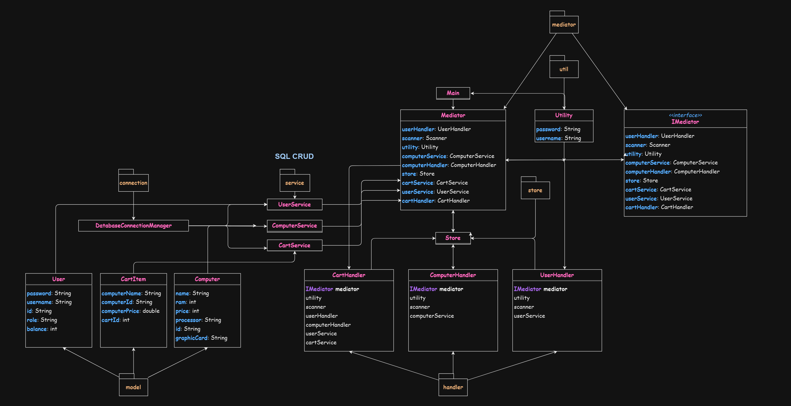

# E-Commerce PC Store

The E-Commerce PC Store is a core Java-based console application designed to manage a computer store's inventory, user accounts, and shopping carts. The system allows users to browse and purchase computers, while administrators can manage the store inventory and user accounts.

## Technologies Used

- **Java**: The primary programming language used for the application.
- **Maven**: A build automation tool used for managing project dependencies and building the project.
- **JDBC (Java Database Connectivity)**: Used for database interactions.
- **MySQL**: For database operations and storage.
- **Properties Files**: Used for configuration management.
- **Standard Java Libraries**:
  - **java.util**: For utility classes like `ArrayList`, `HashMap`, `Properties`, etc.
  - **java.io**: For input and output operations.
  - **java.sql**: For database operations.

## Features

- **User Management**: Registration, login, and personalized account management.
- **Computer Inventory**: Browsing and managing available computers.
- **Shopping Cart**: Adding computers to a cart, viewing cart contents, and completing purchases.
- **Admin Controls**: Enhanced capabilities for managing users and inventory.

## User and Admin Capabilities

### User Capabilities

- **Registration and Login**: Users can create accounts and log in to access the store.
- **Browsing Computers**: Users can view and select a list of available computers with detailed specifications.
- **Shopping Cart**: Users can add computers to their cart, view the products in the cart, clear their cart, and deposit money to purchase selected computers.

### Admin Capabilities

- **Admin Privileges**: Admins can do anything that the users do and have elevated rights to control inventory and user management.
- **Enhanced Inventory Management**: Admins can add new computers, update existing computer details, and remove computers from inventory.
- **User Management**: Admins can view all registered users, delete users, or modify user roles and credentials.

## Challenges Faced

### Technical Challenges

- Understanding when to use public and private access modifiers, as well as setter/getter methods.
- Managing data passing between classes and ensuring decoupling mechanisms.

### Design Challenges

- Implementing the Mediator pattern required multiple refactors.
- Managing the project as it grew larger, leading to the creation of a UML Diagram and studying programming concepts for a cleaner codebase.
- Creating the shopping cart logic, which involved understanding one-to-many relationship patterns.

### Performance Issues

- First-time creation and management of an SQL Database, practicing custom queries for CRUD operations.
- Using GitHub Copilot Pro to write faster queries for `add`, `select`, `update`, and `delete` operations in the service package.

## UML Diagram

I created a UML Diagram to provide a high-level view of the system architecture, illustrating the relationships between key components, classes, and packages.



## Package Description

### `main`

- Initializes and starts the application by setting up mediator and store components.

### `mediator`

- Coordinates actions between store, handlers, and services, ensuring decoupled interaction.

### `store`

- Handles user interactions and command processing.

### `service`

- Manages computer, user, and cart operations, interacting with the SQL database for data persistence using CRUD operations.

### `model`

- Includes classes like `User`, `Computer`, and `CartItem`, defining the properties and methods for each type of object.

### `handler`

- Executes command-line interface operations, handling user inputs and triggering service actions.

### `connection`

- Facilitates connections to different databases using a centralized management class.

### `util`

- Provides common utility methods for tasks like input validation, command processing, or printing.

## Installation

To install and set up the project locally, ensure you have the following prerequisites:

- **Java**: Version 13 or higher installed.
- **MySQL**: MySQL Database Connector and MySQL Community Server installed or any other familiar relational database (Postgre).
- **IDE**: An IDE capable of running Maven projects (e.g., IntelliJ IDEA).

Follow these steps to install and set up the project:

1. **Clone the repository**:
    ```sh
    git clone https://github.com/Frenzy017/pc-project.git
    ```

2. **Navigate to the project directory**:
    ```sh
    cd pc-project
    ```

3. **Build the project using Maven**:
    ```sh
    mvn clean install
    ```
## Acknowledgements

- **University of Helsinki**: For their open-source MOOC Java course.
- **"Oracle Certified Professional Java SE 17 Developer"** by Scott Selikoff and Jeanne Boyarsky: For studying the fundamentals of Java.
- **"Clean Code"** by Robert C. Martin: For guiding the creation of a cleaner codebase and promoting best programming practices.
- **Refactoring Guru**: For their comprehensive resources on design patterns.

## License

This project is licensed under the MIT License. See the `LICENSE` file for more details.
